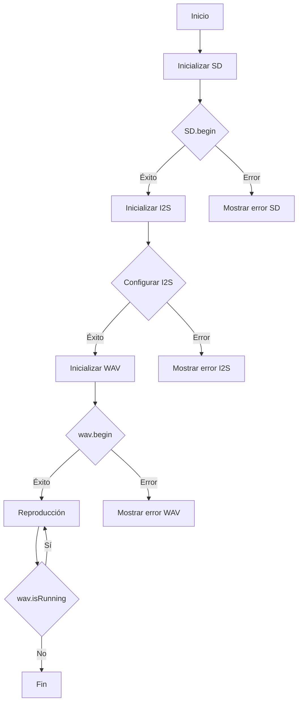

# Informe: Reproducción de Archivo WAV desde Tarjeta SD con ESP32

## Objetivos
- El objetivo de este proyecto es desarrollar un sistema utilizando un ESP32 para reproducir archivos de audio en formato WAV almacenados en una tarjeta SD. El sistema debe ser capaz de leer el archivo WAV desde la tarjeta SD, decodificarlo y reproducirlo utilizando el protocolo I2S.

## Materiales
- ESP32-S3
- Tarjeta SD
- Lector SD
- Altavoz I2S
- Librerias:
```.ini
    lib_deps = esphome/ESP32-audioI2S@^2.0.7
            earlephilhower/ESP8266Audio@^1.9.0
```


## Procedimiento

**Código:**<br>

```cpp
    #include <Arduino.h>
    #include <AudioGeneratorWAV.h>
    #include <AudioOutputI2S.h>
    #include <AudioFileSourceSD.h> // Incluimos la nueva clase para leer desde SD
    #include <SD.h>
    #include <SPI.h>

    // Configuración del I2S para altavoz
    #define I2S_BCLK 10
    #define I2S_LRC 11
    #define I2S_DOUT 12

    // Configuración de la tarjeta SD
    #define SD_CS_PIN 39   // Pin CS de la tarjeta SD
    #define FILE_NAME "/AudioDecodificado_hola.wav" // Nombre del archivo de audio en la tarjeta SD

    AudioFileSourceSD *sd;
    AudioGeneratorWAV *wav;
    AudioOutputI2S *out;

    void setupSD() {
    // Inicializar la tarjeta SD
    SPI.begin(36, 37, 35); // Configura los pines SPI para la comunicación con la SD
    if (!SD.begin(SD_CS_PIN)) {
        Serial.println("Error al montar la tarjeta SD");
        while (true);
    }
    }

    void setup() {
    Serial.begin(115200);
    
    setupSD(); // Inicializa la tarjeta SD
    
    // Inicializa las instancias de las clases
    sd = new AudioFileSourceSD(FILE_NAME); // Inicializa desde SD utilizando el nombre del archivo
    wav = new AudioGeneratorWAV();
    out = new AudioOutputI2S();

    // Configura el protocolo I2S
    out->SetPinout(I2S_BCLK, I2S_LRC, I2S_DOUT);

    // Inicia la reproducción del archivo AAC desde SD
    if (!wav->begin(sd, out)) {
        Serial.println("Error al iniciar la reproducción de WAV desde SD");
        while (true);
    }
    }

    void loop() {
    // Verifica si la reproducción del archivo AAC está en curso
    if (wav->isRunning()) {
        wav->loop();  // Continúa la reproducción del archivo AAC
    } else {
        Serial.println("AAC done");
        delay(10000);
        // Aquí podrías agregar lógica adicional después de la reproducción
    }
    }
```
**Descripción:**<br>
El código implementa la reproducción de un archivo WAV desde una tarjeta SD utilizando un ESP32. Comienza inicializando la comunicación serial y la tarjeta SD. Luego, se configura el protocolo I2S para la salida de audio y se inicia la instancia de las clases ``AudioFileSourceSD``, ``AudioGeneratorWAV`` y ``AudioOutputI2S``. El archivo WAV se carga desde la tarjeta SD y se inicia la reproducción. El programa verifica continuamente si el archivo WAV está en reproducción y ejecuta el bucle de reproducción mientras lo esté.

**Diagrama de flujos:**

## Conclusión: 
En esta práctica, logramos reproducir con éxito archivos WAV desde una tarjeta SD utilizando un ESP32-S3.